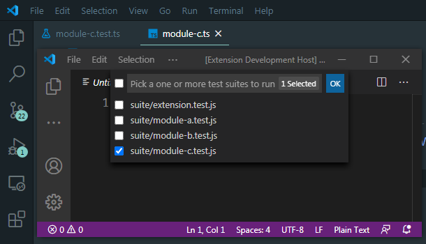
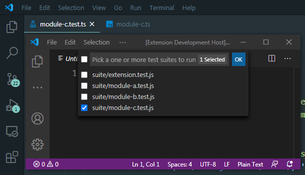
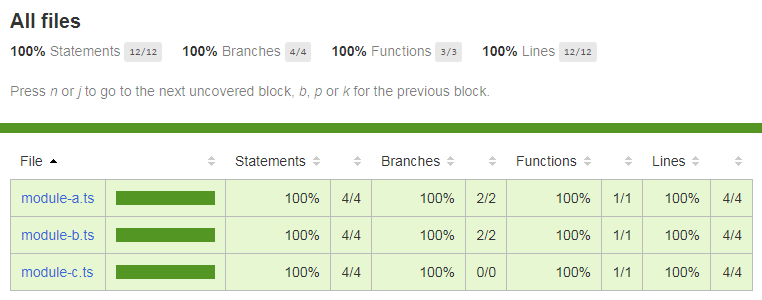
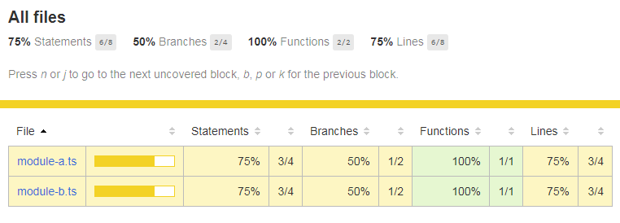
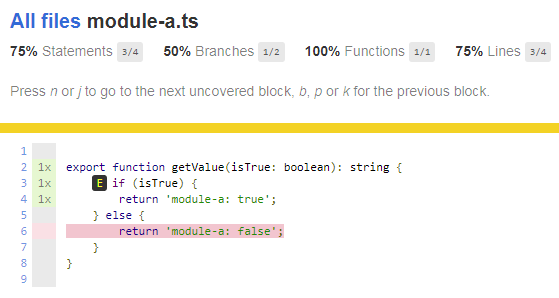

# VS Code NYC test coverage example

An example on how to get test coverage with NYC for VS Code extensions. 

## Features

- GUI to pick a test suite files
- Preselect
    - Preselects currently open module's `.test.ts` suite file
        
        

    - Preselects currently open `.test.ts` suite file
        
        
    

## Additions to 'yo code' template

- Added `nyc` to `devDependencies`

    ```
    npm install --save-dev nyc
    ```

- Added `npm: pretest` task which is used by 'Extension Tests (Coverage)' configuration
- Added `Extension Tests (Select)` configuration
    - Shows GUI to pick a test suite files
    - Preselects with currently open file

- Added `Extension Tests (Coverage)` configuration
    - Shows GUI to pick a test suite files
    - Preselects with currently open file
    - Generates a test coverage report

- Added `nyc-coverage-test-runner.ts`

These additions make it easier to see coverage report in isolation. 

For example:

Running test coverage for `module-c` in this example will show 100% coverage.



While running test coverage for `module-a` & `module-b` will show 



as their test suites are missing some branches. 




## Known Issues

Coverage report will be empty with `*` as one of the `activationEvents` in `package.json`.
